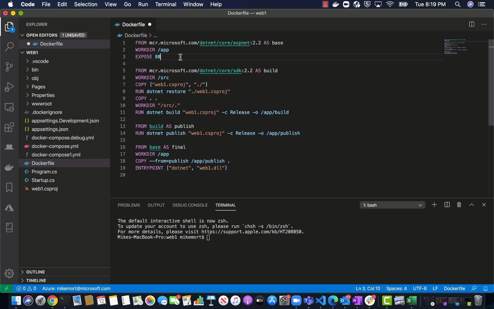
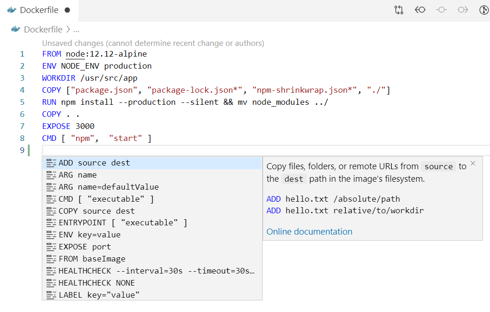
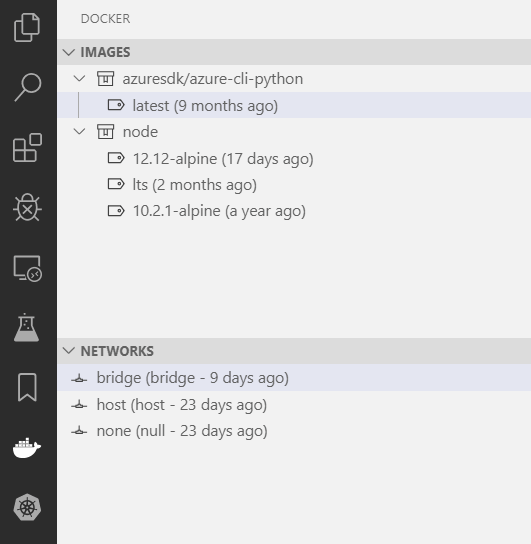
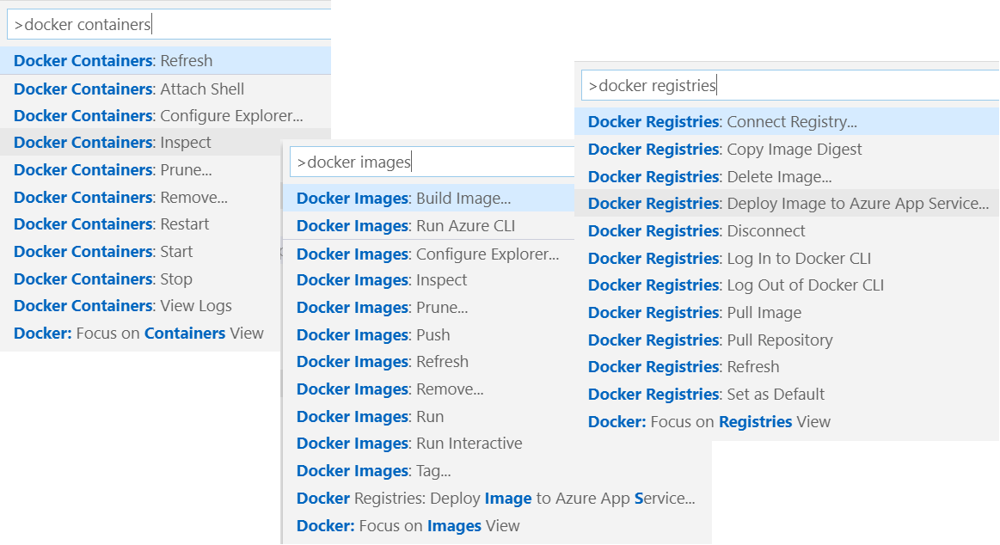
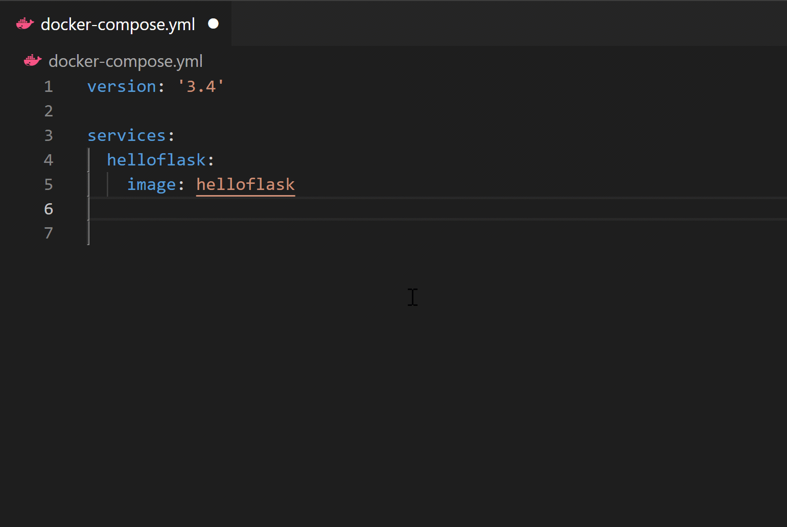
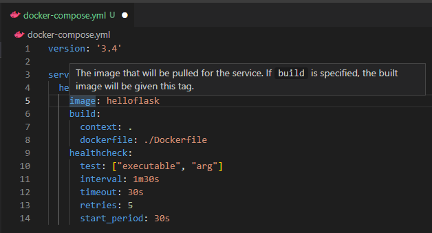
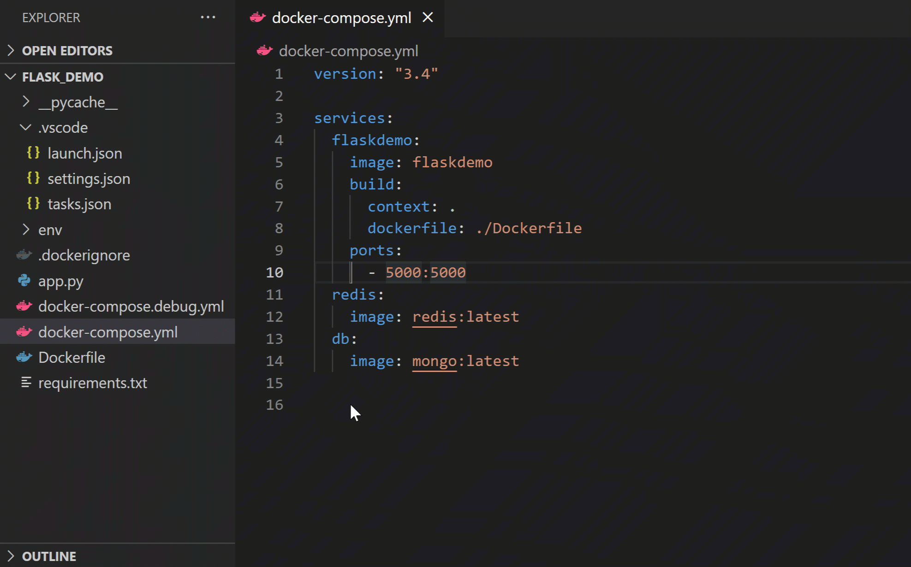
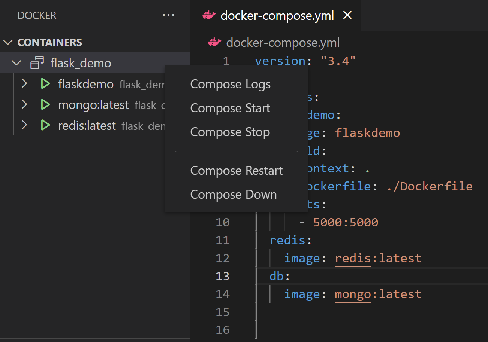
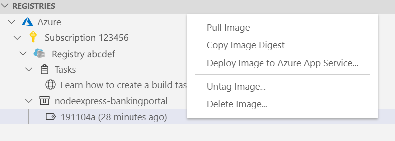

## Docker for Visual Studio Code    

The Docker extension makes it easy to build, manage, and deploy containerized applications from Visual Studio Code. It also provides one-click debugging of Node.js, Python, and .NET inside a container.

**Check out the [Working with containers](https://aka.ms/AA7arez) topic on the Visual Studio Code documentation site to get started**.

[The Docker extension wiki](https://github.com/Microsoft/vscode-docker/wiki) has troubleshooting tips and additional technical information.

## Installation

[Install Docker](https://docs.docker.com/install/) on your machine and add it to the system path.

On Linux, you should [enable rootless Docker](https://docs.docker.com/engine/security/rootless/) and set the generated Docker context to "rootless" (more secure) or [enable Docker CLI for the non-root user account](https://docs.docker.com/install/linux/linux-postinstall/#manage-docker-as-a-non-root-user) (less secure) that will be used to run VS Code.

To install the extension, open the Extensions view, search for `docker` to filter results and select Docker extension authored by Microsoft.

## Overview of the extension features

### Editing Docker files

You can get IntelliSense when editing your `Dockerfile` and `docker-compose.yml` files, with completions and syntax help for common commands.

In addition, you can use the Problems panel (<kbd>Ctrl+Shift+M</kbd> on Windows/Linux, <kbd>Shift+Command+M</kbd> on Mac) to view common errors for `Dockerfile` and `docker-compose.yml` files.

### Generating Docker files

You can add Docker files to your workspace by opening the Command Palette (<kbd>F1</kbd>) and using **Docker: Add Docker Files to Workspace** command. The command will generate a `Dockerfile` and `.dockerignore` file and add them to your workspace. The command will also ask you if you want to add Docker Compose files as well, but this is optional.

The extension can scaffold Docker files for most popular development languages (C#, Node.js, Python, Ruby, Go, and Java) and customizes the generated Docker files accordingly. When these files are created, we also create the necessary artifacts to provide first-class debugging support for Node.js, Python, and .NET (C#).

### Docker Explorer

The Docker extension contributes a Docker Explorer view to VS Code. The Docker Explorer lets you examine and manage Docker assets: containers, images, volumes, networks, and container registries. If the Azure Account extension is installed, you can browse your Azure Container Registries as well.

The right-click menu provides access to commonly used commands for each type of asset.

You can rearrange the Docker view panes by dragging them up or down with a mouse and use the context menu to hide or show them.

### Docker commands

Many of the most common Docker commands are built right into the Command Palette:

You can run Docker commands to manage [images](https://docs.docker.com/engine/reference/commandline/image/), [networks](https://docs.docker.com/engine/reference/commandline/network/), [volumes](https://docs.docker.com/engine/reference/commandline/volume/), [image registries](https://docs.docker.com/engine/reference/commandline/push/), and [Docker Compose](https://docs.docker.com/compose/reference/overview/). In addition, the **Docker: Prune System** command will remove stopped containers, dangling images, and unused networks and volumes.

### Docker Compose

[Docker Compose](https://docs.docker.com/compose/) lets you define and run multi-container applications with Docker. Our [Compose Language Service](https://github.com/microsoft/compose-language-service) in the Docker extension gives you IntelliSense and tab completions when authoring `docker-compose.yml` files. Press `Ctrl+Space` to see a list of valid Compose directives.

 

We also provide tooltips when you hover over a Docker Compose YAML attribute.

 

While `Compose Up` allows you to run all of your services at once, our new feature `Compose Up - Select Services` lets you select any combination of the services you want to run.

Once your `Compose Up` command completes, navigate to the Docker Explorer to view your services as a Compose Group. This allows you to start, stop, and view the logs of each service as a group.

### Using image registries

You can display the content and push, pull, or delete images from [Docker Hub](https://hub.docker.com/) and [Azure Container Registry](https://docs.microsoft.com/azure/container-registry/):

An image in an Azure Container Registry can be deployed to Azure App Service directly from VS Code. See [Deploy images to Azure App Service](https://aka.ms/AA7arf8) to get started. For more information about how to authenticate to and work with registries, see [Using container registries](https://aka.ms/AA7arf9).

### Debugging services running inside a container

You can debug services built using Node.js, Python, or .NET (C#) that are running inside a container. The extension offers custom tasks that help with launching a service under the debugger and with attaching the debugger to a running service instance. For more information, see [Debug containerized apps](https://aka.ms/AA7arfb)  and [Customize the Docker extension](https://aka.ms/AA7ay8l).

### Azure CLI integration

You can start Azure CLI (command-line interface) in a standalone, Linux-based container with **Docker Images: Run Azure CLI** command. This gives you access to the full Azure CLI command set in an isolated environment. For more information on available commands, see [Get started with Azure CLI](https://docs.microsoft.com/cli/azure/get-started-with-azure-cli?view=azure-cli-latest#sign-in).

## Contributing

See [the contribution guidelines](CONTRIBUTING.md) for ideas and guidance on how to improve the extension. Thank you!

### Code of Conduct

This project has adopted the [Microsoft Open Source Code of Conduct](https://opensource.microsoft.com/codeofconduct/). For more information see the [Code of Conduct FAQ](https://opensource.microsoft.com/codeofconduct/faq/) or contact [opencode@microsoft.com](mailto:opencode@microsoft.com) with any additional questions or comments.

## Telemetry

VS Code collects usage data and sends it to Microsoft to help improve our products and services. Read our [privacy statement](https://go.microsoft.com/fwlink/?LinkID=528096&clcid=0x409) to learn more. If you don’t wish to send usage data to Microsoft, you can set the `telemetry.telemetryLevel` setting to `off`. Learn more in our [FAQ](https://code.visualstudio.com/docs/supporting/faq#_how-to-disable-telemetry-reporting).

## License

[MIT](LICENSE.md)
