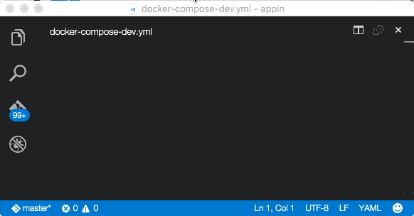
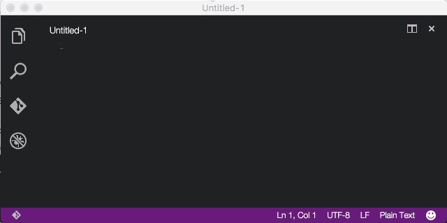

## Docker Extension for Visual Studio Code
-------------------
## Functionality
This extension adds syntax highlighting, snippets and additional intellisense for Dockerfiles and docker-compose files in Visual Studio Code. Hovering over 
commands in your Dockerfile will show you additional information about commands and images. 

Similar functionality is available for docker compose files:

## Install
Open up Visual Studio Code, press F1 and type `ext install` and select **Dockerfile and Docker Compose File (yml) Support**. Once extension is installed you will
be prompted to restart Visual Studio Code.

## Contributing
There are a couple of ways you can contribute to this repo:

- Ideas, feature requests and bugs: We are open to all ideas and we want to get rid of bugs! Use the Issues section to either report a new issue, provide your ideas or contribute to existing threads
- Documentation: Found a typo or strangely worded sentences? Submit a PR!
- Code: Contribute bug fixes, features or design changes.

## Legal
Before we can accept your pull request you will need to sign a **Contribution License Agreement**. All you need to do is to submit a pull request, then the PR will get appropriately labelled (e.g. `cla-required`, `cla-norequired`, `cla-signed`, `cla-already-signed`). If you already signed the agreement we will continue with reviewing the PR, otherwise system will tell you how you can sign the CLA. Once you sign the CLA all future PR's will be labeled as `cla-signed`.

## License 
[MIT](LICENSE)