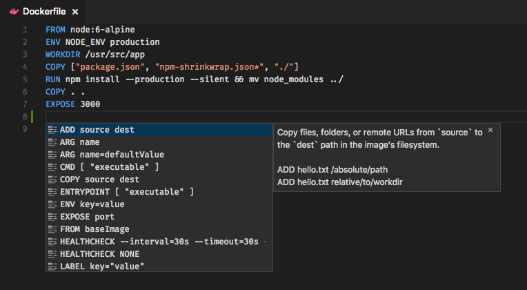
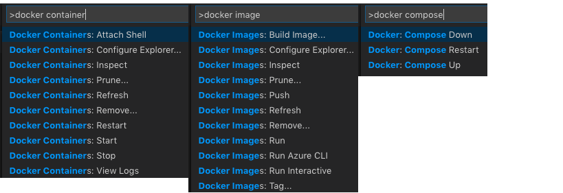
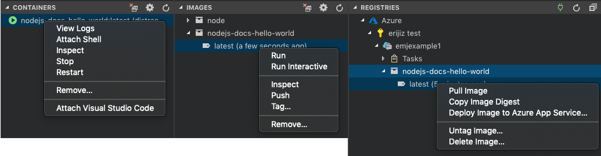
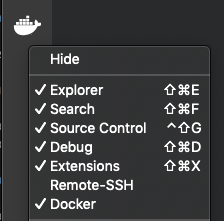
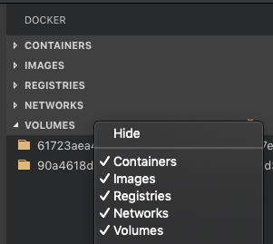
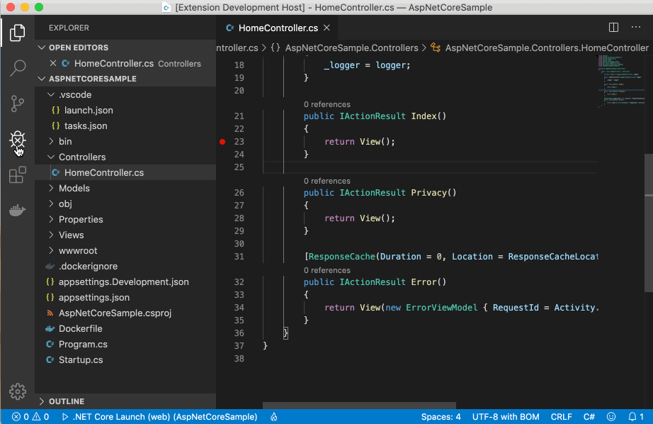

## Docker for Visual Studio Code (Preview)

  

The Docker extension makes it easy to build, manage and deploy containerized applications from Visual Studio Code. Check out the ["Working with Docker" tutorial](https://code.visualstudio.com/docs/azure/docker) to get started.

**Visit the [wiki](https://github.com/Microsoft/vscode-docker/wiki) for additional information about the extension.**

## Prerequisites

Install [Docker](https://aka.ms/AA37qtj) on your machine and add it to the system path.

On Linux, you must also follow the steps in “Manage Docker as a non-root user” from [Post-installation steps for Linux](https://aka.ms/AA37yk6) because VS Code runs as a non-root user.

## Features

* Automatic `Dockerfile`, `docker-compose.yml`, and `.dockerignore` file generation (Open the command Palette, <kbd>F1</kbd> by default, and search for `Docker: Add Docker files to Workspace`)
* Syntax highlighting, hover tips, IntelliSense (completions) for `docker-compose.yml` and `Dockerfile` files
* Linting (errors and warnings) for `Dockerfile` files
* Command Palette (<kbd>F1</kbd> by default) integration for the most common Docker commands (for example `docker build`, `docker push`, etc.)
* Explorer integration for managing images, containers, registries, and more
* Deploy images from a registry directly to Azure App Service
* [Debug .NET Core applications](https://aka.ms/AA6jdzn) running in Linux Docker containers

### Generating Docker Files

Press <kbd>F1</kbd> (by default) and search for `Docker: Add Docker Files to Workspace` to generate `Dockerfile`, `docker-compose.yml`, `docker-compose.debug.yml`, and `.dockerignore` files for your workspace type:

> Note: The `docker-compose.yml` and `docker-compose.debug.yml` files are not generated for all platforms, such as .NET Core applications, and are optional for Node.js applications.

### Editing

Rich IntelliSense (completions) for `Dockerfile` and `docker-compose.yml` files:

### Docker Commands

Many of the most common Docker commands are built right into the Command Palette (<kbd>F1</kbd> by default):

### Docker View

The Docker extension contributes explorers to view and manage containers, images, registries, volumes, and networks. The right click context menus provide quick access to the same rich set of commands found in the Command Palette (<kbd>F1</kbd> by default).

**TIP**: You can reorder the explorers by clicking and dragging on the explorer title. You can also hide the entire view by right clicking on the Docker icon or hide individual explorers by right clicking on the explorer title.

 

### Debugging in Containers

With the Docker extension installed, you can easily debug .NET Core and Node.js apps within a container. Debugging support is enabled automatically when you dockerize your code with `Docker: Add Docker Files to Workspace`. To enable debugging for code that's already dockerized, open the Command Palette (<kbd>F1</kbd> by default) and do `Docker: Initialize for Docker Debugging`.

### Tasks

Use Visual Studio Code's tasks to build and launch Docker containers with custom settings like ports, volumes, networks, etc.

### Registries

The first time you expand the registries explorer you'll be prompted to connect a registry. This will prompt you for credentials based on your provider (Azure, Docker Hub, etc.). These credentials will be stored in your operating system credentials vault (for example macOS keychain, Windows Credential Store) so that you don't need to sign in every time. You can right click on a registry provider to disconnect it and remove credentials from the OS store.

> **NOTE**: Azure leverages the [Azure Account Extension](https://marketplace.visualstudio.com/items?itemName=ms-vscode.azure-account) instead of storing Docker-specific credentials. After connecting Azure, you will be prompted separately to install that extension and/or sign in.

### Deploy images to Azure App Service

With the Docker Explorer you can deploy images from Docker Hub Registries or Azure Container Registries directly to an Azure App Service instance. Check out [this tutorial](https://code.visualstudio.com/tutorials/docker-extension/getting-started) to get started.

### Azure CLI

Microsoft ships the latest [Azure CLI](https://github.com/azure/azure-cli) as a [Docker image](https://hub.docker.com/r/azuresdk/azure-cli-python/). You can easily launch a container running the CLI from the Command Palette (press <kbd>F1</kbd> by default and search for `Docker Images: Run Azure CLI`). The extension will then run an interactive terminal attached to the container.

After the container is started, you will be prompted to sign in to your Azure account. From there, set the subscription you want to work with using `az account set` (you can see all of your subscriptions with `az account list`). You do not need to sign in every time you run the container because the extension volume mounts the local `$HOME/.azure` folder to the container's `$HOME/.azure` folder.

### Connect to `docker-machine`

The default behavior of the extension is to connect to the local Docker daemon. You can connect to a docker-machine instance if you launch Visual Studio Code and have the [Docker environment variables](https://docs.docker.com/machine/reference/env/) set in your environment or through the following VS Code settings: `docker.host`, `docker.certPath`, `docker.tlsVerify`, and `docker.machineName`.

## Contributing

There are a couple of ways you can contribute to this repo:

* **Ideas, feature requests, and bugs**: We are open to all ideas and we want to get rid of bugs! Use the Issues section to either report a new issue, provide your ideas or contribute to existing threads.
* **Documentation**: Found a typo or strangely worded sentences? Submit a PR!
* **Code**: Contribute bug fixes, features, or design changes:
  * Clone the repository locally and open in VS Code.
  * Install [TSLint for Visual Studio Code](https://marketplace.visualstudio.com/items?itemName=ms-vscode.vscode-typescript-tslint-plugin).
  * Open the terminal (<kbd>CTRL</kbd>+ <kbd>\`</kbd> by default) and run `npm install`.
  * To build, open the Command Palette (<kbd>F1</kbd> by default) and type in `Tasks: Run Build Task`.
  * Debug: press <kbd>F5</kbd> (by default) to start debugging the extension.

### Legal

Before we can accept your pull request you will need to sign a **Contribution License Agreement**. All you need to do is to submit a pull request, then the PR will get appropriately labelled (e.g. `cla-required`, `cla-norequired`, `cla-signed`, `cla-already-signed`). If you already signed the agreement we will continue with reviewing the PR, otherwise system will tell you how you can sign the CLA. Once you sign the CLA all future PR's will be labeled as `cla-signed`.

### Code of Conduct

This project has adopted the [Microsoft Open Source Code of Conduct](https://opensource.microsoft.com/codeofconduct/). For more information see the [Code of Conduct FAQ](https://opensource.microsoft.com/codeofconduct/faq/) or contact [opencode@microsoft.com](mailto:opencode@microsoft.com) with any additional questions or comments.

## Telemetry

VS Code collects usage data and sends it to Microsoft to help improve our products and services. Read our [privacy statement](https://go.microsoft.com/fwlink/?LinkID=528096&clcid=0x409) to learn more. If you don’t wish to send usage data to Microsoft, you can set the `telemetry.enableTelemetry` setting to `false`. Learn more in our [FAQ](https://code.visualstudio.com/docs/supporting/faq#_how-to-disable-telemetry-reporting).

## License

[MIT](LICENSE.md)
