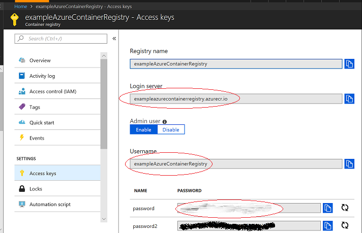

# Docker Support for Visual Studio Code

[](https://travis-ci.org/Microsoft/vscode-docker) [](https://github.com/Microsoft/vscode-docker/releases)

The Docker extension makes it easy to build, manage and deploy containerized applications from Visual Studio Code, for example:

* Automatic `Dockerfile`, `docker-compose.yml`, and `.dockerignore` file generation (Press `F1` and search for `Docker: Add Docker files to Workspace`)
* Syntax highlighting, hover tips, IntelliSense (completions) for `docker-compose.yml` and `Dockerfile` files
* Linting (errors and warnings) for `Dockerfile` files
* Command Palette (`F1`) integration for the most common Docker commands (for example `docker build`, `docker push`, etc.)
* Explorer integration for managing Images, running Containers, and Docker Hub registries
* Deploy images from Docker Hub and Azure Container Registries directly to Azure App Service
* [Working with docker](https://code.visualstudio.com/docs/azure/docker) will walk you through many of the features of this extension


## Generating Docker Files

Press `F1` and search for `Docker: Add Docker files to Workspace` to generate `Dockerfile`, `docker-compose.yml`, `docker-compose.debug.yml`, and `.dockerignore` files for your workspace type:


> Note: The `docker-compose.yml` and `docker-compose.debug.yml` files are not generated for .NET Core applications.

## Editing

Rich IntelliSense (completions) for `Dockerfile` and `docker-compose.yml` files:


## Docker commands

Many of the most common Docker and docker compose commands are built right into the Command Palette (`F1`).


## Docker View

The Docker extension contributes a new `Docker` View to VS Code. Within the View, the Explorer lets you view and manage your Images, Containers, and browse your Docker Hub registry. If the [Azure Account](https://marketplace.visualstudio.com/items?itemName=ms-vscode.azure-account) extension is installed, you can browse your [Azure Container Registries](https://docs.microsoft.com/en-us/azure/container-registry/) as well.

The right click context menu provides quick access to the same rich set of commands found in the Command Palette (`F1`).


You can move the View up or down by dragging the Docker icon and you can hide the View by right clicking on the icon and choosing `Hide`. To bring it back, right click on the Activity Bar area and check the `Docker` item.


The `showExplorer` configuration setting controls the visibility of the Docker View.

``` json
"docker.showExplorer": false
```

## Docker Hub Login
The first time you expand the Docker Hub node you'll be prompted to log in to your Docker Hub account.


Your user name and password are stored in your operating system credentials vault (for example macOS keychain, Windows Credential Store) so that you don't need to log in every time. You can log out of Docker Hub by right clicking on the Docker Hub label and choosing log out. This will delete the credentials from the OS store.

## Deploying images to Azure App Service

With the Docker Explorer you can deploy images from Docker Hub Registries or Azure Container Registries directly to an Azure App Service instance, as detailed in this [getting started](https://code.visualstudio.com/tutorials/docker-extension/getting-started) guide. This functionality requires installing the [Azure Account](https://marketplace.visualstudio.com/items?itemName=ms-vscode.azure-account) extension and an Azure Subscription. If you do not have an Azure subscription, [sign up today](https://azure.microsoft.com/en-us/free/?b=16.48) for a free 30 day account and get $200 in Azure Credits to try out any combination of Azure services.

To log into Azure, press `F1` and search for `Azure Sign In`. You will then sign into your account using the Device Login flow. Click on "Copy & Open" to open your default browser.


Paste in the access code and continue the sign in process.


You can now right click on an image in Docker Hub or an Azure Container Registry and choose "Deploy Image to Azure App Service".


From here you will be prompted for a Resource Group, location, an App Service Plan, and a globally unique website name.

## Azure CLI

Microsoft ships the latest [Azure CLI](https://github.com/azure/azure-cli) as a [Docker image](https://hub.docker.com/r/azuresdk/azure-cli-python/). You can easily launch a container running the CLI from the Command Palette (press F1 and search for `Docker: Azure CLI`). The extension will then run an interactive terminal attached to the container.

After the container is started, you will be prompted to login to your Azure account. From there, set the subscription you want to work with using `az account set` (you can see all of your subscriptions with `az account list`). You do not need to login in every time you run the container because the extension volume mounts the local `$HOME/.azure` folder to the container's `$HOME/.azure` folder.

## Configuration Settings

The Docker extension comes with a number of useful configuration settings allowing you to customize your workflow.

| Setting | Description | Default Value |
| --- |---|---|
| `docker.attachShellCommand.linuxContainer` | Attach command to use for Linux containers | `/bin/sh`
| `docker.attachShellCommand.windowsContainer` | Attach command to use for Windows containers | `powershell`
| `docker.dockerComposeBuild` | Run docker-compose with the --build argument, defaults to true | `true`
| `docker.dockerComposeDetached` | Run docker-compose with the --d (detached) argument, defaults to true | `true`
| `docker.defaultRegistry` | Default registry when tagging an image, empty string will target Docker Hub when pushing. | `""`
| `docker.defaultRegistryPath` | Path within registry to push to. | `""`
| `docker.explorerRefreshInterval` | Explorer refresh interval, default is 1000ms. | `1000`
| `docker.imageBuildContextPath` | Build context PATH to pass to Docker build command. | `""`
| `docker.languageserver.diagnostics.deprecatedMaintainer` | Controls the diagnostic severity for the deprecated MAINTAINER instruction. | `warning`
| `docker.languageserver.diagnostics.directiveCasing` | Controls the diagnostic severity for parser directives that are not written in lowercase. | `warning`
| `docker.languageserver.diagnostics.emptyContinuationLine` | Controls the diagnostic severity for flagging empty continuation lines found in instructions that span multiple lines. | `warning`
| `docker.languageserver.diagnostics.instructionCasing` | Controls the diagnostic severity for instructions that are not written in uppercase. | `warning`
| `docker.languageserver.diagnostics.instructionCmdMultiple` | Controls the diagnostic severity for flagging a Dockerfile with multiple CMD instructions. | `warning`
| `docker.languageserver.diagnostics.instructionEntrypointMultiple` | Controls the diagnostic severity for flagging a Dockerfile with multiple ENTRYPOINT instructions. | `warning`
| `docker.languageserver.diagnostics.instructionHealthcheckMultiple` | Controls the diagnostic severity for flagging a Dockerfile with multiple HEALTHCHECK instructions. | `warning`
| `docker.languageserver.diagnostics.instructionJSONInSingleQuotes` | Controls the diagnostic severity for JSON instructions that are written incorrectly with single quotes. | `warning`
| `docker.promptOnSystemPrune` | Prompt for confirmation when running System Prune command | `true`
| `docker.showExplorer` | Show or hide the Explorer. | `true`
| `docker.truncateLongRegistryPaths` | Truncate long Image and Container registry paths in the Explorer. | `false`
| `docker.truncateMaxLength` | Maximum number of characters for long registry paths in the Explorer, including ellipsis. | `10`
| `docker.host` | Host to connect to (same as setting the DOCKER_HOST environment variable) |

## Installation

In VS Code, open the Extension Viewlet, type in `Docker`, locate the extension and click on `Install`. Once the extension is installed you will be prompted to restart Visual Studio Code which will only take (literally) a couple of seconds.

Of course, you will need to have Docker installed on your computer in order to run commands from the Command Palette (F1, type in `Docker`).

## Running commands on Linux

By default, Docker runs as the root user, requiring other users to access it with `sudo`. This extension does not assume root access, so you will need to create a Unix group called docker and add users to it. Instructions can be found here: [Create a Docker group](https://docs.docker.com/install/linux/linux-postinstall/)

## Connecting to `docker-machine`

The default connection of the extension is to connect to the local docker daemon. You can connect to a docker-machine instance if you launch Visual Studio Code and have the DOCKER_HOST environment variable set to a valid host or if you set the `docker.host` configuration setting.

If the docker daemon is using TLS, the DOCKER_CERT_PATH environment variable must also be set (e.g. `$HOME\.docker\machine\machines\default`). See [docker documentation](https://docs.docker.com/machine/reference/env/) for more information.

## Contributing

There are a couple of ways you can contribute to this repository:

* Ideas, feature requests and bugs: We are open to all ideas and we want to get rid of bugs! Use the Issues section to either report a new issue, provide your ideas or contribute to existing threads
* Documentation: Found a typo or strangely worded sentences? Submit a PR!
* Code: Contribute bug fixes, features or design changes.

## Legal

Before we can accept your pull request you will need to sign a **Contribution License Agreement**. All you need to do is to submit a pull request, then the PR will get appropriately labelled (for example `cla-required`, `cla-norequired`, `cla-signed`, `cla-already-signed`). If you already signed the agreement we will continue with reviewing the PR, otherwise system will tell you how you can sign the CLA. Once you sign the CLA all future PR's will be labeled as `cla-signed`.

## Troubleshooting

### I get "unauthorized: authentication required" in the terminal when executing some commands, such as "Docker: push".

Make sure you are signed in to the Docker Hub or Azure container registry from the docker CLI via `docker login` (using your username, not your e-mail address).

If you are using an Azure container registry, you will need to get the username and password from Azure by right-clicking on the Azure container registry in the extension and selecting "Browse in the Azure Portal", then selecting the "Access Keys" tab.


Finally, execute `docker login`, for example:

```bash
docker login exampleazurecontainerregistry.azurecr.io
```

and respond with the username and password specified by Azure.

### I'm on Linux and get the error "Unable to connect to Docker, is the Docker daemon running?"

Since VS Code runs as a non-root user, you will need to follow the steps in “Manage Docker as a non-root user” from [Post-installation steps for Linux](https://docs.docker.com/install/linux/linux-postinstall/) for the extension to be able to access docker.

## Telemetry

This extension collects telemetry data to help us build a better experience for building micro-service applications with Docker and VS Code. We only collect data on which commands are executed. We do not collect any information about image names, paths, etc. The extension respects the `telemetry.enableTelemetry` setting which you can learn more about in our [FAQ](https://code.visualstudio.com/docs/supporting/faq#_how-to-disable-telemetry-reporting).

## License

[MIT](LICENSE.md)
