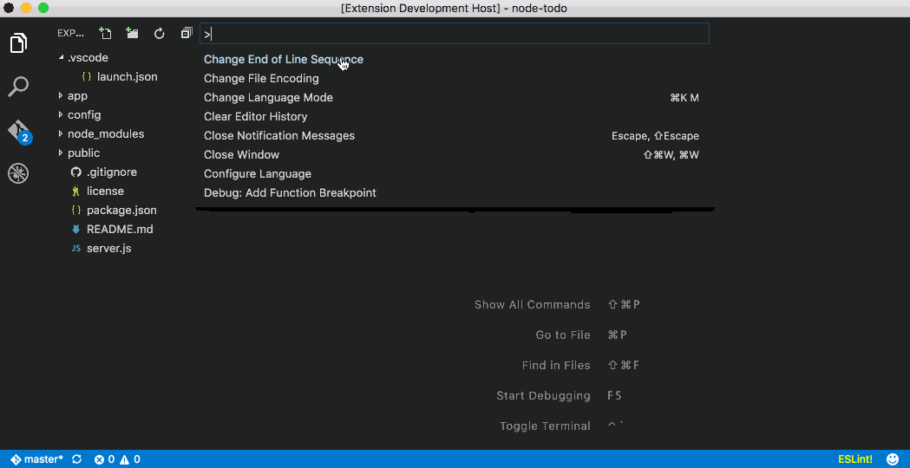
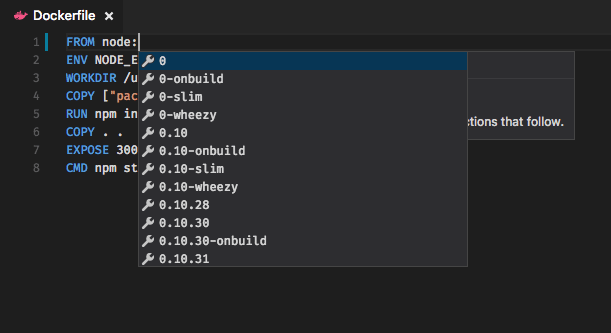
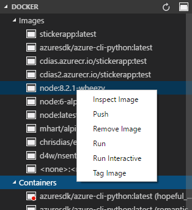
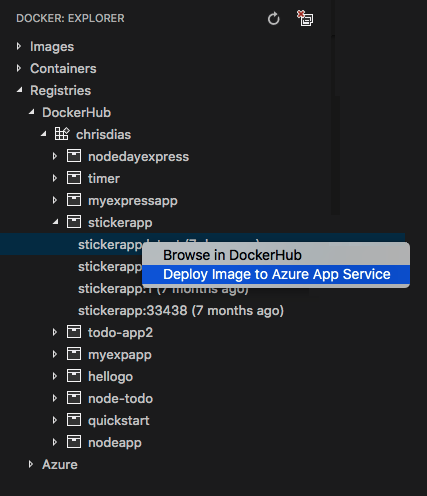

# Docker Support for Visual Studio Code
The Docker extension makes it easy to build and deploy containerized applications from Visual Studio Code. 

* Automatic `Dockerfile` and `docker-compose.yml` file generation 
* Syntax highlighting and hover tips for `docker-compose.yml` and `Dockerfile files`
* IntelliSense (completions) for `Dockerfile` and `docker-compose.yml` files
* Linting (errors and warnings) for `Dockerfile` files
* Command Palette (`F1`) integration for the most common Docker commands (e.g. Build, Push)
* Explorer integration for managing Images and Containers
* Deploy images from DockerHub and Azure Container Registries to Azure App Service

## Generating `Dockerfile`, `docker-compose.yml`, and `docker-compose.debug.yml`


## IntelliSense (completions) for `Dockerfile` and `docker-compose.yml` files.


## IntelliSense (completions) for images




## Docker commands
Many of the most common Docker and docker compose commands are built right into the Command Palette (`F1`).

 

## Explorer Integration
The Docker Explorer lets you view and manage your Images, Containers, and browse your DockerHub registry. If the [Azure Account](https://marketplace.visualstudio.com/items?itemName=ms-vscode.azure-account) extension is installed, you can browse your Azure Container Registries as well. 

The right click context menu provides quick access to the same rich set of commands found in the Command Palette (`F1`).



You can move the Explorer up or down by dragging the `DOCKER` sash, you can hide the Explorer by right clicking on the `DOCKER` sash and choosing `Remove from side bar`. To bring it back, right click on the `EXPLORER` title at the top of the side bar. This state is persisted on a _per-workspace_ basis. 

If you want to turn the Explorer off for all workspaces, set the `showExplorer` configuration setting to `false`. Press `CMD+,` (or `CTRL+,` on Windows/Linux) to bring up the user level settings and add this to the right side:

``` json
"docker.showExplorer": false
```

## Deploying images to Azure App Service

With the Docker Explorer you can deploy images from DockerHub Registries or Azure Container Registries, directly to an Azure App Service instance. This functionality requires installing the [Azure Account](https://marketplace.visualstudio.com/items?itemName=ms-vscode.azure-account) extension and an Azure Subscription. If you do not have an Azure subscription, [sign up today](https://azure.microsoft.com/en-us/free/?b=16.48) for a free 30 day account and get $200 in Azure Credits to try out any combination of Azure services.

The first time you expand the DockerHub node you'll be prompted to log into your DockerHub account.


Your user name and password are stored in your operating system credentials vault (e.g. MacOS keychain, Windows Credential Store) so that you don't need to log in every time. You can log out of DockerHub by right clicking on the DockerHub label and choosing log out. This will delete the credentials from the OS store.

To log into Azure, press `F1` and search for `Azure Login`. You will then sign into your account using the Device Login flow. Click on "Copy & Open" to open your default browser.


Paste in the access code and continue the sign in process.


You can now right click on an image in DockerHub or an Azure Container Registry and choose "Deploy Image to Azure App Service".



From here you will be prompted for a Resource Group, location, an App Service Plan, and a globally unique website name.

## Azure CLI
Microsoft ships the latest [Azure CLI](https://github.com/azure/azure-cli) as a [Docker image](https://hub.docker.com/r/azuresdk/azure-cli-python/). You can easily launch a container running the CLI from the Command Palette (press F1 and search for `Docker: Azure CLI`). The extension will then run an interactive terminal attached to the container. 

After the container is started, you will be prompted to login to your Azure account. From there, set the subscription you want to work with using `az account set` (you can see all of your subscriptions with `az account list`). You do not need to login in every time you run the container becasue the extension volume mounts the local `$HOME/.azure` folder to the container's `$HOME/.azure` folder. 

## Installation
In VS Code, press F1 and type in `ext install vscode-docker`. Once the extension is installed you will be prompted to restart Visual Studio Code which will only take (literally) a couple of seconds. 

Of course, you will want to have Docker installed on your computer in order to run commands from the Command Palette (F1, type in `Docker`).  

## Running commands on Linux
By default, Docker runs as the root user, requiring other users to access it with `sudo`. This extension does not assume root access, so you will need to create a Unix group called docker and add users to it. Instructions can be found here: [Create a Docker group](https://docs.docker.com/engine/installation/linux/linux-postinstall/)

## Connecting to docker-machine
The default connection of the extension is to connect to the local docker daemon. You can connect to a docker-machine instance if you launch Visual Studio Code and have the DOCKER_HOST environment variable set to a valid host.

## Contributing
There are a couple of ways you can contribute to this repo:

- Ideas, feature requests and bugs: We are open to all ideas and we want to get rid of bugs! Use the Issues section to either report a new issue, provide your ideas or contribute to existing threads
- Documentation: Found a typo or strangely worded sentences? Submit a PR!
- Code: Contribute bug fixes, features or design changes.

## Legal
Before we can accept your pull request you will need to sign a **Contribution License Agreement**. All you need to do is to submit a pull request, then the PR will get appropriately labelled (e.g. `cla-required`, `cla-norequired`, `cla-signed`, `cla-already-signed`). If you already signed the agreement we will continue with reviewing the PR, otherwise system will tell you how you can sign the CLA. Once you sign the CLA all future PR's will be labeled as `cla-signed`.

## Telemetry
This extension collects telemetry data to help us build a better experience for building micro-service applications with Docker and VS Code. We only collect data on which commands are executed. We do not collect any information about image names, paths, etc. The extension respects the `telemetry.enableTelemetry` setting which you can learn more about in our [FAQ](https://code.visualstudio.com/docs/supporting/faq#_how-to-disable-telemetry-reporting).
 
## License 
[MIT](LICENSE)
