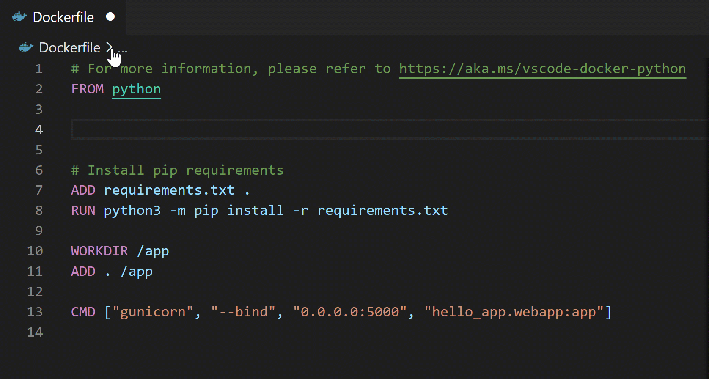

## Add dockerfiles to workspace
A Dockerfile is a text document that contains all the commands a user would sequentially call on the command line to assemble an image. Running your app in a container allows you to create a near-production, reproducible runtime environment so you can code and deploy with greater confidence.

Open the command pallete (Ctrl + Shift + P) and choose **Docker: Add Dockerfiles to Workspace** to complete this step.

