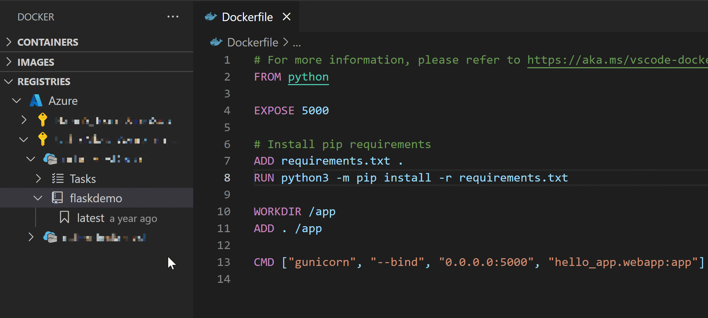

## Deploy to App Service
The Docker extension helps you deploy your containerized applications and take advantage of a fully-managed platform using Azure App Service. Prior to deployment, the image must be uploaded to either Azure Container Registry or Docker Hub.

After a successful deployment, select **Open Site** in the notification. Your container is running in Azure!

